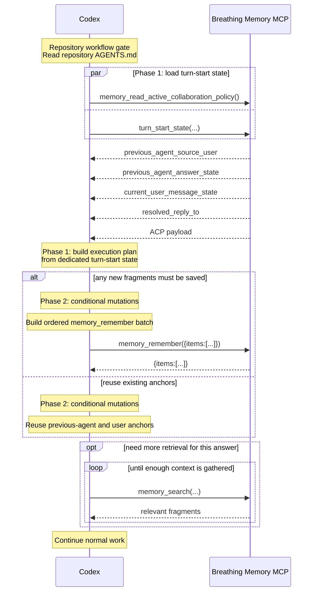
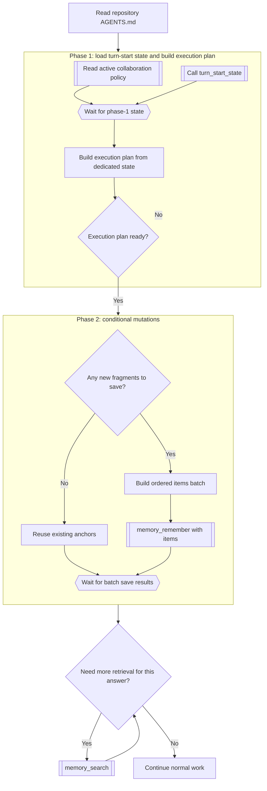

# MCP Turn Flows

This document focuses on the active dedicated-API design target for Breathing Memory turn start.

It is not the normative source of truth. Current required behavior still lives in [spec.md](spec.md) and in the managed Breathing Memory block that `breathing-memory install-codex` writes into `AGENTS.md`.

## Active Design Target: `turn_start_state(...)` + Batched `memory_remember(...)`

### Design Goals

- Minimize Codex decision turns first.
- Keep the context needed for each turn as small as possible.
- Treat `Read repository AGENTS.md` as a repository workflow gate, not as a memory-protocol RTT phase.
- Use a dedicated turn-start API instead of overloading `memory_recent(...)` with thread resolution.
- Keep single-item `memory_remember(...)` behavior intact and only add the minimum batch behavior needed for linked saves.
- Keep `memory_recent(...)` as a low-level recent-fragment tool unless and until callers no longer need it.

### API Direction

This design does not treat the new API as a successor to `memory_recent(...)`.

`memory_recent(...)` remains a low-level tool for checking recent remembered fragments.

The active design target is:

- a dedicated turn-start read API, tentatively named `turn_start_state(...)`
- a batched form of `memory_remember(...)` for ordered linked saves

`turn_start_state(...)` returns the state needed to close the turn-start execution plan.

The expected response shape is:

- `previous_agent_source_user`
  The single user fragment that the expected previous agent answer replied to, when that source user exists.
- `previous_agent_answer_state`
  Whether the expected previous agent answer is already remembered and, if so, which existing anchor should be reused.
- `current_user_message_state`
  Whether the current user message is already remembered and, if so, which existing anchor should be reused.
- `resolved_reply_to`
  The reply target that should be used if the current user message must be saved.

The batch `memory_remember(...)` direction is:

- keep the existing single-item input and output unchanged
- add a batch request shape of `{"items":[...]}`
- add a batch response shape of `{"items":[...]}`
- let each batch item reuse the existing single-item fields, plus:
  - `client_id`
    A caller-chosen identifier for linking later items inside the same batch.
  - `reply_to_item`
    A reference to an earlier batch item's `client_id`.

Expected batch request shape:

```json
{
  "items": [
    {
      "client_id": "previous_agent",
      "actor": "agent",
      "content": "...",
      "reply_to": 55
    },
    {
      "client_id": "current_user",
      "actor": "user",
      "content": "...",
      "reply_to_item": "previous_agent"
    }
  ]
}
```

Expected batch response shape:

```json
{
  "items": [
    {
      "id": 101,
      "anchor_id": 101,
      "reply_to": 55,
      "kind": null,
      "content": "...",
      "content_length": 3,
      "layer": "working",
      "compression_fail_count": 0,
      "reference_score": 0,
      "confidence_score": 0,
      "search_priority": 0
    },
    {
      "id": 102,
      "anchor_id": 102,
      "reply_to": 101,
      "kind": null,
      "content": "...",
      "content_length": 3,
      "layer": "working",
      "compression_fail_count": 0,
      "reference_score": 0,
      "confidence_score": 0,
      "search_priority": 0
    }
  ]
}
```

### Sequence View

This view shows who calls what, where waiting happens, and why the common case should collapse to two Codex decision turns.



Notes:

- The target common case is one phase-1 state load followed by one phase-2 mutation call.
- The dedicated read API should tell Codex whether the previous final agent answer already exists, whether the current user message already exists, and what `reply_to` should be used if the current user message must be saved.
- `previous_agent_source_user` is expected to be a single object, not a candidate list.
- The batched `memory_remember(...)` form should preserve request order so later items can safely depend on earlier items.
- `reply_to_item` should point only to an earlier item's `client_id`.
- ACP remains a separate read API even in this design.

### Flowchart View

This view shows the same design as phases and dependency barriers rather than actors and messages.



Notes:

- The design target is to make phase 1 deterministic enough that retry inside phase 1 is exceptional rather than normal.
- `turn_start_state(...)` should return exactly the state needed for reply-target safety and duplicate avoidance, not a generic recent-fragment list.
- The batch `memory_remember(...)` form should allow one ordered save call instead of separate previous-agent and current-user mutation calls.
- `memory_recent(...)` is no longer the active extension point in this design; it stays as a lower-level API.
- Double-bracket nodes represent MCP calls.
- The wait nodes show the real dependency barriers: after turn-start state load and after batch save results.
- When both fragments must be saved, `reply_to_item` lets the second save depend on the first inside one ordered batch.

## Open Questions

- What should the exact request shape of `turn_start_state(...)` be?
- Should `previous_agent_answer_state` and `current_user_message_state` return only `existing_anchor_id | needs_save`, or should they also include the matched fragment content?
- Should batch-mode `memory_remember(...)` require every item to specify exactly one of `reply_to` or `reply_to_item`, or should root items remain valid in the batch form?
- Should `memory_recent(...)` remain permanently as a low-level helper, or should it be deprecated after callers migrate to the dedicated turn-start API?
