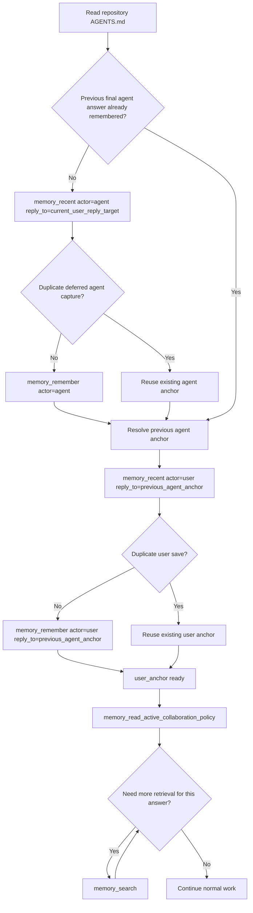
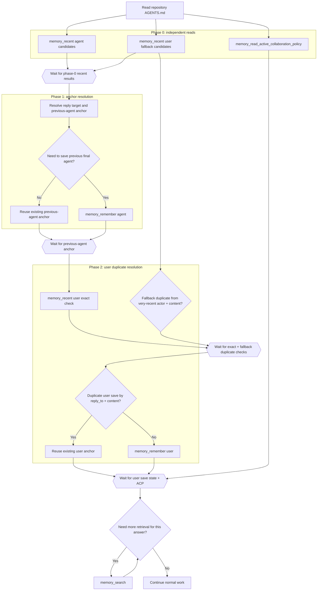

# MCP Turn Flows

This document compares the current caller flow, an active client-parallel design target, and one parked bundled alternative for Breathing Memory turn start.

It is not the normative source of truth. Current required behavior still lives in [spec.md](spec.md) and in the managed Breathing Memory block that `breathing-memory install-codex` writes into `AGENTS.md`.

## 1. Current AGENTS-Managed Flow

This is the current caller-side flow expected by the managed `AGENTS.md` guidance.

Notes:

- This flow is compatible with the current managed `AGENTS.md` ordering.
- `memory_remember(actor="user")` depends on the previous agent anchor when the user is replying to the immediately previous answer.
- `memory_read_active_collaboration_policy` happens after the current user save and before other substantive tool calls.

## 2. Client-Parallel Sketch

This proposal separates repository workflow constraints from the memory protocol itself. In the memory protocol layer, the caller first gathers recent agent candidates, recent user duplicate candidates, and ACP in parallel, then resolves anchor threading and duplicate handling from those results.

Notes:

- This proposal treats `Read repository AGENTS.md` as a repository workflow gate, not as part of the memory protocol RTT phases.
- Duplicate checks still matter in this sketch; parallelization changes when checks happen, not whether they exist.
- This proposal does not require `reply_to` to be fully known before the first memory-protocol phase starts.
- The initial parallel phase is for collecting candidates, not for finalizing threading.
- The caller resolves anchor threading from recent results before the exact user duplicate check runs.
- Running ACP in parallel is coherent only if ACP loading is treated as independent from current-user save ordering.
- This proposal keeps the real data dependencies while matching the observed pattern where callers inspect recent fragments and `anchor_id` values before finalizing saves.
- The explicit `Wait ...` nodes show the actual dependency barriers: after phase-0 candidate gathering, after previous-agent anchor resolution, after exact user duplicate checking, and before retrieval starts.

## 3. Parked Bundled `memory_begin_turn` Sketch

This idea is currently parked. It may be revisited later, but it is not the active design target while caller-side anchor resolution remains uncertain.

Notes:

- The attractive part of this idea is RTT reduction, not clearer semantics.
- The blocking issue is anchor resolution: observed callers often inspect recent fragments and `anchor_id` values before they know what should be saved.
- Until that responsibility is made explicit, bundling the whole turn-start mutation path risks baking in the wrong contract.
- For now, this sketch is retained only as a reminder of a possible later optimization boundary.

## Comparison

| Flow | Sequential RTT phases before optional search | Preserves real dependency constraints | Main tradeoff |
| --- | --- | --- | --- |
| Current AGENTS-managed flow | 3 or 5 | Yes | More client round trips |
| Client-parallel sketch | 2 or 3 | Yes | Requires explicit caller-side anchor resolution from recent results |
| Parked bundled `memory_begin_turn` sketch | 1 | Unclear today | Anchor-resolution responsibility is not stable enough yet |

## Recommendation

Use the current AGENTS-managed flow as the normative caller contract today.

Use the client-parallel sketch as the active design target. It matches the observed pattern where callers inspect recent fragments and `anchor_id` values before finalizing saves.

Keep the bundled `memory_begin_turn` idea parked until anchor-resolution responsibilities are stable enough to specify cleanly.
