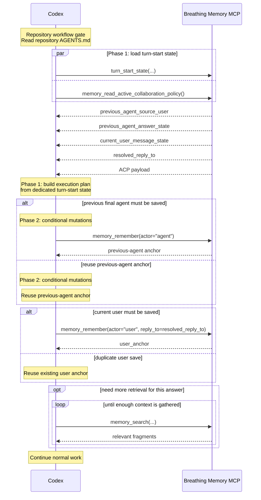
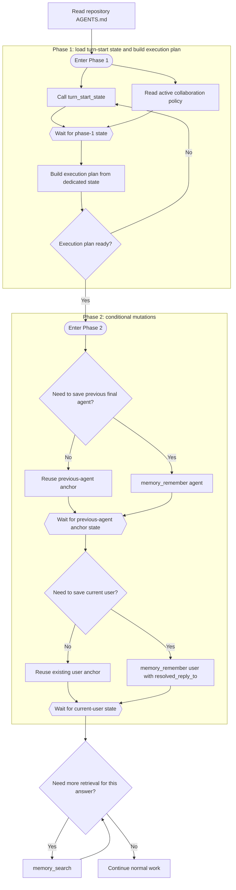

# MCP Turn Flows

This document focuses on the active dedicated-API design target for Breathing Memory turn start.

It is not the normative source of truth. Current required behavior still lives in [spec.md](spec.md) and in the managed Breathing Memory block that `breathing-memory install-codex` writes into `AGENTS.md`.

## Active Design Target: Dedicated `turn_start_state` API

### Design Goals

- Minimize Codex decision turns first.
- Keep the context needed for each turn as small as possible.
- Treat `Read repository AGENTS.md` as a repository workflow gate, not as a memory-protocol RTT phase.
- Use a dedicated turn-start API instead of overloading `memory_recent(...)` with thread resolution.
- Keep `memory_recent(...)` as a low-level recent-fragment tool unless and until callers no longer need it.

### API Direction

This design does not treat the new API as a successor to `memory_recent(...)`.

`memory_recent(...)` remains a low-level tool for checking recent remembered fragments.

The active design target is a dedicated turn-start API, tentatively named `turn_start_state(...)`, that returns the state needed to close the turn-start execution plan.

The expected response shape is:

- `previous_agent_source_user`
  The single user fragment that the expected previous agent answer replied to, when that source user exists.
- `previous_agent_answer_state`
  Whether the expected previous agent answer is already remembered and, if so, which existing anchor should be reused.
- `current_user_message_state`
  Whether the current user message is already remembered and, if so, which existing anchor should be reused.
- `resolved_reply_to`
  The reply target that should be used if the current user message must be saved.

### Sequence View

This view shows who calls what, where waiting happens, and why the common case should collapse to two Codex decision turns.

Notes:

- The target common case is one phase-1 state load followed by phase-2 mutations.
- The dedicated API should tell Codex whether the previous final agent answer already exists, whether the current user message already exists, and what `reply_to` should be used if the user message must be saved.
- `previous_agent_source_user` is expected to be a single object, not a candidate list.
- ACP remains a separate read API even in this design.

### Flowchart View

This view shows the same design as phases and dependency barriers rather than actors and messages.

Notes:

- The design target is to make phase 1 deterministic enough that retry inside phase 1 is exceptional rather than normal.
- `turn_start_state(...)` should return exactly the state needed for reply-target safety and duplicate avoidance, not a generic recent-fragment list.
- `memory_recent(...)` is no longer the active extension point in this design; it stays as a lower-level API.
- The wait nodes show the real dependency barriers: after turn-start state load, after previous-agent anchor state, and after current-user state.
- Current-user mutation still waits on `resolved_reply_to` stability. When the previous agent must be newly saved, phase 2 remains partially serial for that branch.

## Open Questions

- What should the exact request shape of `turn_start_state(...)` be?
- Should `previous_agent_answer_state` and `current_user_message_state` return only `existing_anchor_id | needs_save`, or should they also include the matched fragment content?
- Should `memory_recent(...)` remain permanently as a low-level helper, or should it be deprecated after callers migrate to the dedicated turn-start API?
