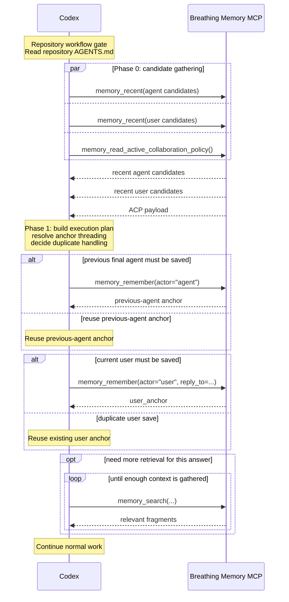
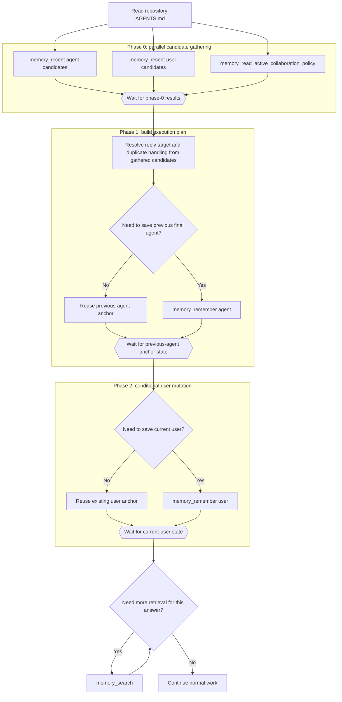

# MCP Turn Flows

This document focuses on the active client-parallel design target for Breathing Memory turn start.

It is not the normative source of truth. Current required behavior still lives in [spec.md](spec.md) and in the managed Breathing Memory block that `breathing-memory install-codex` writes into `AGENTS.md`.

## Active Design Target: Client-Parallel Sketch

### Design Goals

- Minimize Codex decision turns first.
- Keep the context needed for each turn as small as possible.
- Treat `Read repository AGENTS.md` as a repository workflow gate, not as a memory-protocol RTT phase.
- Gather enough candidate memory in the first round so later phases mostly decide and mutate instead of re-reading.

### Sequence View

This view shows who calls what, where waiting happens, and why the common case should collapse to two Codex decision turns.

Notes:

- The target common case is `gather -> mutate`, which keeps Codex to two decision turns.
- The branch case becomes `gather -> remember agent -> remember user` when the current user save depends on a newly created previous-agent anchor.
- ACP is loaded during phase 0 so it is ready before retrieval planning and normal work continue.

### Flowchart View

This view shows the same design as phases and dependency barriers rather than actors and messages.

Notes:

- The design target is to make phase-0 candidate gathering rich enough that phase 1 can decide both threading and duplicate handling without another read in the common case.
- `memory_recent(agent)` should gather enough signal for previous-agent duplicate detection and anchor-resolution planning.
- `memory_recent(user)` should gather user-side candidates, not just a single duplicate check result.
- The wait nodes show the real dependency barriers: after candidate gathering, after previous-agent anchor state, and after current-user state.

## Open Questions

- What is the minimum `memory_recent(user)` payload that still lets phase 1 decide current-user save behavior without an extra read in the common case?
- What recent-agent fields are sufficient for previous-agent anchor resolution while keeping phase-0 context small?
- If phase-0 candidates are insufficient, what is the cleanest fallback without losing the main goal of minimizing Codex decision turns?
