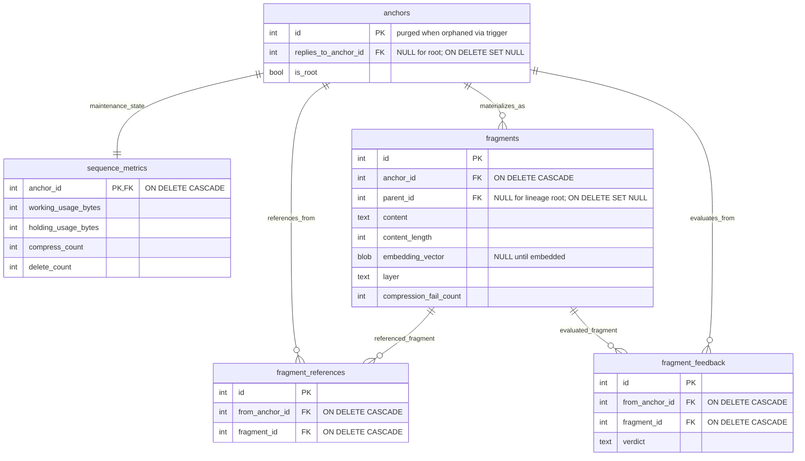
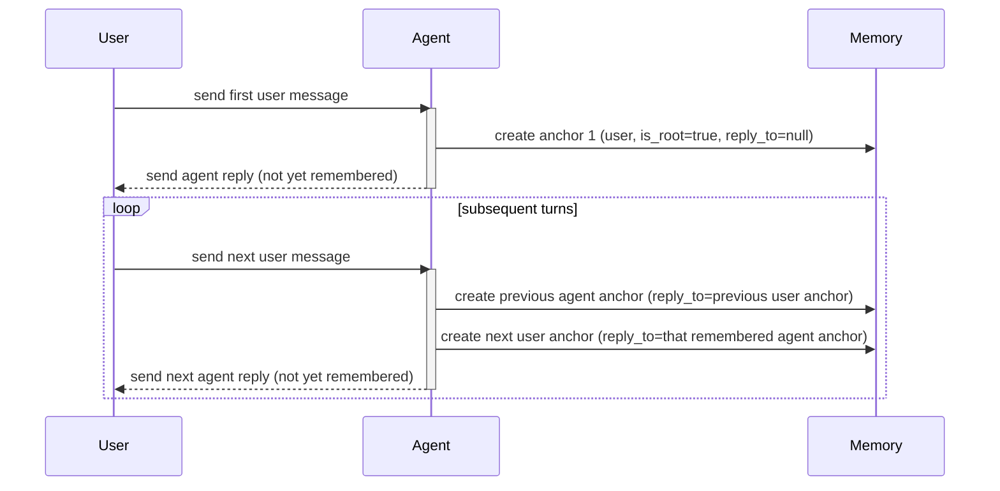
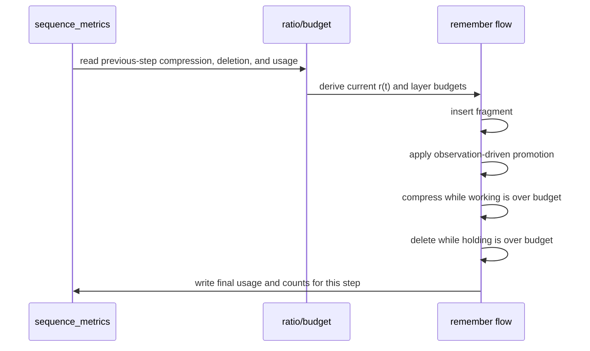
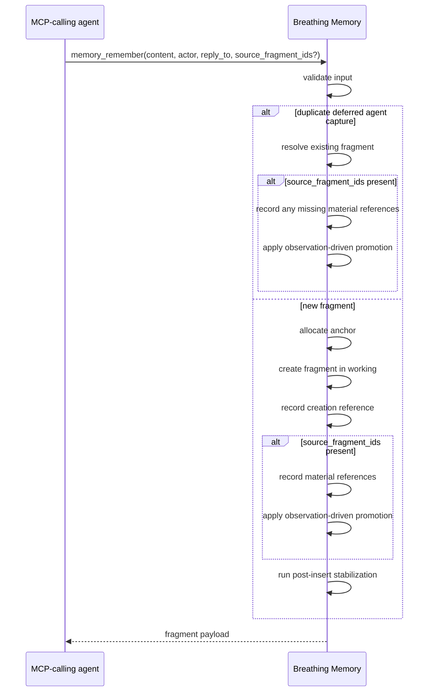
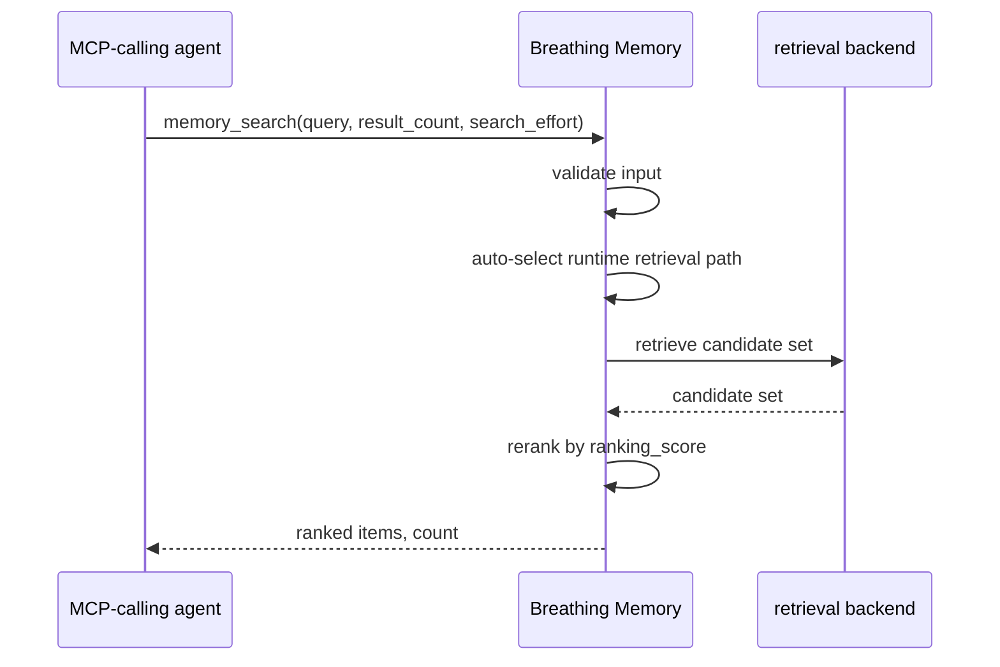
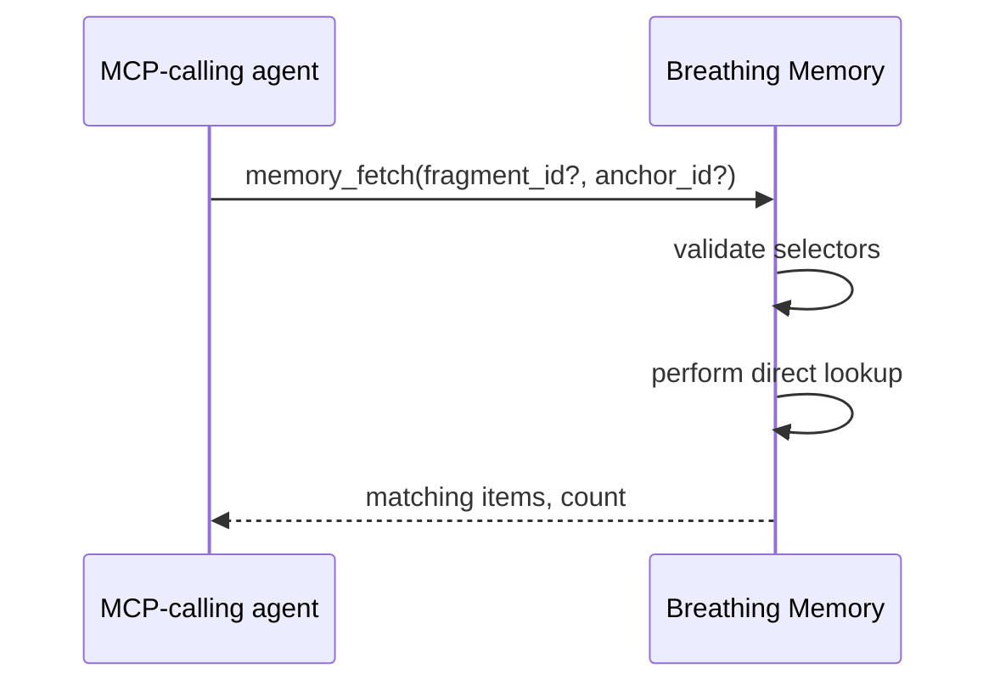
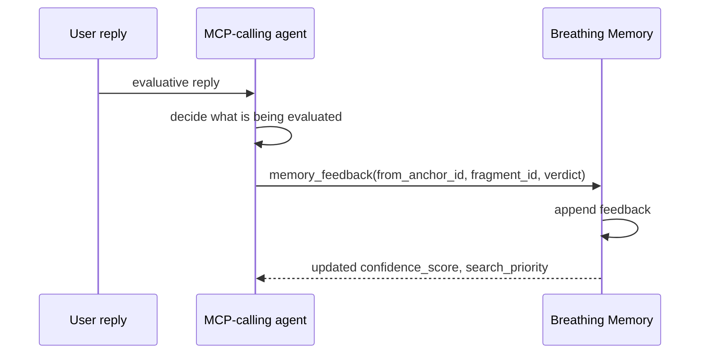

# Breathing Memory Specification

## Summary

Breathing Memory manages the fluid parts of agent collaboration that are awkward to keep as repository source of truth: conversational context, user preferences, working tendencies, and other high-churn memory that an agent should remember but a repository should not need to constantly document. It treats that memory as competitive fragments instead of a fixed ontology. Fragments survive through reference, compression, correction, and deletion pressure. The model is inspired by human forgetting and by treating remembered information as subject to selection pressure. The current implementation provides a local Python implementation with SQLite persistence and an official Python SDK-based stdio MCP server.

By default, the packaged runtime stores SQLite state under user app-data rather than inside the consuming repository, while remembered content remains isolated by project identity so different repositories and directories do not get mixed together.

Conversation capture relies on explicit MCP calls from the MCP-calling agent.

## Design Principles

Breathing Memory is built around the following design ideas:

- remembered content is not treated as fixed knowledge; it is treated as fragments that compete to survive
- forgetting is part of the model rather than a failure of the model
- retrieval-time ranking is a prediction about what may matter next
- concrete reference use and user feedback are observations about what actually mattered
- observations update remembered relations, evaluations, and layer placement
- compression, deletion, and bounded storage act as selection pressure on remembered fragments

## Agreed Design Direction

The implemented direction is:

Memory units:

- `fragment` is the primary memory unit
- one user utterance becomes one fragment
- one final user-facing agent reply becomes one fragment
- intermediary commentary and progress updates are not remembered
- `actor` identifies whether the fragment was emitted by the user or the agent

Conversation structure:

- `anchor` is the semantic conversation axis, while `fragment` is a concrete stored realization
- each fragment belongs to exactly one `anchor`
- reply structure points to the semantic conversation item actually being answered
- `reply_to` targets an `anchor`
- compression children inherit the parent's `anchor_id`

Relations:

- the remembered fragment carries which concrete fragments it actually referenced for the final reply
- concrete final-answer use is recorded as a reference observation rather than as a generic search hit
- references and evaluations are observed from concrete fragment use and concrete fragment evaluation, while source-side continuity is stored on the emitting anchor
- reference and feedback relations use `fragment_id` foreign keys and disappear when the referenced or evaluated fragment is purged

Forgetting:

- `fragments` stays live-only and purges forgotten fragments physically; any forgetting history needed later lives in dedicated aggregates instead of remaining in the fragment table
- if a materially used referenced fragment currently lives in `holding`, it is promoted back to `working`

Retrieval:

- project-wide search spans the whole project even when a fragment originated inside one conversation
- semantic retrieval is designed around a pluggable embedding backend rather than a hard-coded provider
- query generation remains on the MCP-calling agent side; Breathing Memory receives the query and performs retrieval
- retrieval queries stay in the user's language and avoid unnecessary translation or paraphrase
- retrieval-time ranking predicts which fragments matter

## Scope

Includes:

Core memory loop:

- fragment creation and storage
- reference logging
- feedback logging
- score calculation
- capacity maintenance through compression and deletion

Retrieval and compression foundation:

- an embedding-ready retrieval architecture with pluggable providers
- a compression backend that invokes a coding agent without leaving normal conversation history

Runtime surface:

- five MCP tools: `memory_remember`, `memory_search`, `memory_fetch`, `memory_feedback`, `memory_stats`
- project-scoped default storage resolution for reuse across multiple repositories
- a helper CLI for registering the stdio server with the currently supported client

Excludes:

Advanced linking and retrieval:

- file-aware linking beyond raw path text in conversation content
- a mandatory built-in embedding provider

External runtime dependencies:

- dependencies on arbitrary external compression services instead of the current local agent-invocation backend
- production monitoring or deployment infrastructure

## Terms

- `working`: active layer preferred for compression
- `holding`: fallback layer preferred for deletion
- `actor`: whether the fragment was emitted by the user or the agent
- `anchor`: semantic conversation item used for reply structure
- `verdict`: exactly one of `positive`, `neutral`, or `negative`

## Storage Model



Notes:

Identity and ordering:

- `anchor` is the semantic identity axis; `fragment` is a concrete realization of that anchor
- anchors, fragments, and relation rows use append-order integer ids
- columns are `NOT NULL` unless this diagram or the notes explicitly say otherwise
- the nullable columns in this model are `anchors.replies_to_anchor_id`, `fragments.parent_id`, and `fragments.embedding_vector`

Lifecycle:

- that orphan-anchor purge rule is not expressed by ordinary foreign keys alone; it is enforced by a database trigger or equivalent lifecycle control
- `fragments` is live-only; forgotten fragments are purged, while any deletion or layer-transition history needed for forgetting is summarized into dedicated aggregates before purge

Maintenance support:

- maintenance aggregate state lives in `sequence_metrics`, separate from the semantic anchor row

### `anchors`

- `id`: anchor identifier
- `replies_to_anchor_id`: semantic item actually being answered
- `is_root`: whether this anchor was born as a true root

Notes:

Semantic role:

- `anchor` is the semantic conversation item, while `fragment` is its concrete stored realization
- anchors are structural helpers for fragments, so an anchor is purged once no fragment realizes it

Reply semantics:

- `anchors.replies_to_anchor_id` points to the semantic item actually being answered
- `anchors.is_root = true` marks a true root anchor, while non-root anchors store `is_root = false`
- anchors born as true roots store `replies_to_anchor_id = null` at creation time
- if a replied-to anchor is purged, `replies_to_anchor_id` is cleared to `null` while `is_root = false` preserves the fact that the anchor was not born as a root
- forked replies, including edits of earlier remembered messages, are modeled as sibling branches that legitimately share the same `replies_to_anchor_id`
- editing an earlier remembered message leaves the old branch intact and continues from a new branch instead of overwriting the old one

Canonical reply examples:

- the first user anchor in a conversation has `is_root = true` and `replies_to_anchor_id = null`
- a normal agent anchor is remembered on the next user turn and points `replies_to_anchor_id` at the user anchor it answered
- the next user anchor has `is_root = false` and points `replies_to_anchor_id` at that remembered agent anchor
- a forked user anchor has `is_root = false` and points `replies_to_anchor_id` at an earlier reachable anchor
- an edited earlier reply is stored as another forked anchor that keeps the edited reply's `replies_to_anchor_id`

The same reply structure can be visualized as:



### `fragments`

- `id`: fragment identifier
- `anchor_id`: semantic item realized by this fragment
- `parent_id`: parent fragment when that parent is still recorded; `null` when this fragment has no recorded parent or its recorded parent has already been purged
- `content`: text body
- `content_length`: cached UTF-8 byte count
- `embedding_vector`: stored semantic-retrieval payload, encoded as a normalized `float32` vector in `BLOB`
- `layer`: `working` or `holding`
- `compression_fail_count`: number of failed compression attempts

Notes:

Lifecycle:

- this table contains only current fragments
- once a fragment is forgotten, the fragment row is physically purgeable after its required maintenance history has been summarized into `sequence_metrics`
- that summarized history is concrete: `working_usage_bytes`, `holding_usage_bytes`, `compress_count`, and `delete_count`
- historical movement between `working` and `holding` lives in `sequence_metrics`, not on the fragment row itself

Self-feedback:

- a normal newly created fragment creates one self-targeted positive feedback relation
- a compression child does not create that extra self-feedback relation

Compression and lineage:

- a compression child inherits the parent's `anchor_id`
- a compression child stores the parent's fragment id in `parent_id`
- the semantic reply relation lives on the anchor, so it naturally survives fragment replacement
- `parent_id` is generic fragment-lineage metadata and serves both tracing and the return of a failure signal when a compression child is purged before its parent
- `parent_id` is sufficient lineage storage; no separate compression-lineage table is needed

Embeddings:

- `embedding_vector` stays `NULL` until an embedding backend is configured or backfill has run
- when the embedding provider changes, all existing live fragments are re-embedded so retrieval stays inside one consistent vector space
- a compression child regenerates its own `embedding_vector` from the compressed text instead of copying the parent's vector
- embeddings are stored at fragment granularity, using `fragments.content` as the source text

### Relation semantics

Source and target:

- a concrete fragment being materially used or concretely evaluated emits a relation from its anchor
- the source continuity of a reference or evaluation belongs to that anchor, while the target is a concrete fragment
- semantic-level views are obtained by grouping referenced or evaluated fragments under their `anchor_id`

Compression effects:

- when a source fragment is replaced by compression inside the same anchor, the source-side meaning continues through that anchor
- when a referenced or evaluated fragment is replaced by compression, future reference and feedback point at the new fragment, while past interactions stay attached to the old concrete fragment
- compression duplicates a parent's concrete reference and feedback relations onto the child
- this duplication is intentional: parent and child both keep their own relations because a compressed child is not assumed to be a lossless substitute

Purge effects:

- when no live fragment remains under a source anchor, its outgoing relations lose their meaning
- when a referenced or evaluated fragment is purged, relations pointing at it disappear with it rather than survive as dangling history

### `fragment_references`

- `id`: log identifier
- `from_anchor_id`: source anchor
- `fragment_id`: referenced fragment

Notes:

- a normal newly created fragment emits one self-targeted reference row
- a compression child inherits duplicated reference relations from the parent and emits one additional self-targeted reference row

### `fragment_feedback`

- `id`: log identifier
- `from_anchor_id`: source anchor
- `fragment_id`: evaluated fragment
- `verdict`: `positive`, `neutral`, or `negative`

Notes:

- a normal newly created fragment emits one self-targeted `positive` feedback row
- a compression child inherits duplicated feedback relations from the parent but does not emit a new self-targeted `positive` row

### `sequence_metrics`

- `anchor_id`: anchor whose maintenance aggregate state is captured here
- `working_usage_bytes`: working-layer usage at that anchor step
- `holding_usage_bytes`: holding-layer usage at that anchor step
- `compress_count`: recent compression count retained for maintenance
- `delete_count`: recent deletion count retained for maintenance

Notes:

- deletion bookkeeping stays out of `fragments`; forgotten fragments are physically purged from that table
- `sequence_metrics` retains the maintenance history needed after those purges
- each remember flow writes or updates exactly one `sequence_metrics` row for its current anchor step after post-insert stabilization finishes
- that row records the final `working` / `holding` usage and the compression / deletion counters accumulated during that remember flow
- usage-derived pressure comes from `sequence_metrics`
- dynamic layer-ratio updates also read their recent compression and deletion counters from `sequence_metrics`
- no separate `runtime_state` or `aging_snapshots` table is required as long as anchor ids and relation ids preserve append order

## Parameters

Candidate selection:

- `b = 2.0`: compression failure penalty base

Dynamic layer ratio:

- `r(0) = 0.5`: initial working ratio
- `r_floor = 0.3`: lower working-ratio bound; the upper bound is derived symmetrically as `1 - r_floor`
- `N = 64`: recent anchor-step window for compression and deletion rates

Compression:

- `compression_ratio = 0.8`: target compression amount, leaving roughly 20% of the original text

## Semantic Retrieval Modes

Modes:

- `super_lite`
  - lexical search only
  - the minimal fallback when semantic retrieval is unavailable
- `lite`
  - embedding search without a dedicated ANN index
  - the debug / intermediate fallback when semantic vectors are available but the ANN index is unavailable
- default mode
  - embedding search with HNSW
  - the primary HNSW-backed path

Runtime selection:

- the runtime keeps a retrieval-mode setting
- the default setting is `auto`
- in `auto`, the runtime selects `default` when both the embedding backend and HNSW index are available
- in `auto`, the runtime selects `lite` when embeddings are available but the ANN index is unavailable
- in `auto`, the runtime selects `super_lite` when semantic retrieval is unavailable
- the setting includes explicit pinning to `super_lite`, `lite`, or `default` for debugging, reproducibility, or operational fallback

Shared ranking model:

- the implementation keeps the same reranking model across all three modes
- `reference_score` and `search_priority` remain raw core model values
- only `normalized_search_priority` is normalized, and only inside retrieval blending

Mode-specific retrieval:

- `lite` mode compares the query vector against all live fragment vectors directly
- default mode uses an approximate nearest-neighbor index over live fragment embeddings rather than changing the core ranking model

HNSW lifecycle:

- the HNSW index lives outside SQLite as a separate index file
- when a fragment is physically purged, its index entry is physically removed when the index implementation supports that cleanly
- when clean physical removal is not supported, the index marks the entry deleted and removes it on the next rebuild
- when the embedding provider changes, all live fragments are re-embedded and the HNSW index is rebuilt from scratch
- the same rebuild path is also reused when the configured index file is missing or invalid while semantic-index mode is enabled
- while a full semantic-index rebuild is in progress, other memory APIs do not mutate or query the semantic index

Current default stack:

- the default embedding model class is small multilingual sentence embedding
- default HNSW parameters are `M = 16`, `efConstruction = 128`, `efSearch = 64`

Pre-release evaluation:

- the first embedding model to try is `sentence-transformers/paraphrase-multilingual-MiniLM-L12-v2`
- the pre-release comparison candidate is `intfloat/multilingual-e5-small`

Public API floor:

- the minimum supported public `search_effort` is `32`

Embedding backend boundary:

- the embedding plugin interface stays minimal: text in, vector out
- the plugin does not own fragment storage, vector persistence, nearest-neighbor indexing, similarity calculation, or final reranking
- Breathing Memory itself owns re-embedding on provider changes, semantic candidate selection, normalization of `search_priority` inside the semantic result set, and final reranking

## Formulas

### Reference Recency

Reference weighting uses the source anchor's relative position within the anchor sequence.

One direct form is:

```text
anchor_distance(e, a) = a.current_anchor_id - e.from_anchor_id
relative_recency(e, a) = exp(-anchor_distance(e, a) / sqrt(a.current_anchor_span))
```

where `a.current_anchor_id` is the current append-order anchor id used for retrieval and `a.current_anchor_span` is the current append-order anchor span visible to retrieval.

### Pressure

```text
pressure_working(k) = working_usage_bytes(k) / working_budget_bytes(k)
```

`pressure_working(k)` is computed from the historical working-layer usage at anchor step `k` divided by the working budget at anchor step `k`.

Pressure affects only maintenance decisions such as compression and deletion thresholds. It does not directly warp reference recency.

### Reference Score

```text
reference_score(m) = log(1 + Σ relative_recency(e, a))
```

`reference_score` is not naturally bounded to `[0, 1]` or `<= 2`; the log term compresses growth, but additional surviving reference mass can still raise it over time.

### Confidence

```text
feedback_value(positive) = 1
feedback_value(neutral) = 0
feedback_value(negative) = -1
feedback_mean(m) = average(feedback_value(verdict))
confidence_score(m) = (feedback_mean(m) + 1) / 2
```

`confidence_score` maps surviving user feedback onto `[0, 1]`. A fragment with only positive feedback converges toward `1`, a fragment with only negative feedback converges toward `0`, and a fragment with balanced or purely neutral feedback stays near `0.5`.

### Search Priority

```text
search_priority(m) = reference_score(m) * confidence_score(m)
```

`search_priority` is the core non-semantic ranking value. It combines how often and how recently a fragment has been referenced with how positively it has been evaluated by surviving feedback.

### Retrieval Ranking Score

```text
normalized_search_priority(m) =
    search_priority(m) / max_search_priority(result_set)

ranking_score(m) = semantic_similarity(m) * normalized_search_priority(m)
```

`normalized_search_priority` rescales the raw core score inside the current result set so it can be blended cleanly with semantic similarity. `ranking_score` is therefore a retrieval-time, query-local value, not a core stored memory value. It is intended for ranking and diagnostics inside one search execution, not for absolute comparison across different queries.

### Deviation

```text
s(m) = log(1 + search_priority(m))
center = median(s)
spread = MAD(s) + ε
deviation(m) = (s(m) - center) / spread
```

`deviation` measures how unusual a fragment's `search_priority` is relative to the current live distribution. Positive values indicate fragments that are unusually strong; negative values indicate fragments that are unusually weak. `MAD` keeps the scale estimate robust against outliers.

### Compression Candidate

```text
failure_penalty(m) = b ^ compression_fail_count(m)
compress_pick_score(m) = pressure_working * |deviation(m)| / failure_penalty(m)
```

Compression candidates are drawn from the `working` layer only. The single `working` fragment with the highest score is chosen.

Compression prefers fragments that are far from the center of the live distribution while also discounting fragments that have already failed compression repeatedly. The failure penalty keeps the system from retrying the same bad candidate too aggressively.

### Delete Candidate

```text
delete_pick(m) = argmin_{m in holding} search_priority(m)
```

Deletion candidates are drawn from the `holding` layer only. The single `holding` fragment with the lowest `search_priority` is chosen.

Deletion is intentionally simpler than compression. It directly removes the weakest fragment in the current live ordering instead of using the two-sided `deviation` measure.

## Maintenance Rules

### Dynamic Layer Ratio

Compression and deletion counts are observed over the last `N` anchor steps:

```text
compress_rate = compress_count_last_N / N
delete_rate = delete_count_last_N / N
delta = compress_rate - delete_rate
r_min = r_floor
r_max = 1 - r_floor
up_room = (r_max - r(t)) / (1 - 2 * r_floor)
down_room = (r(t) - r_min) / (1 - 2 * r_floor)

if delta >= 0:
    r(t+1) = r(t) + up_room * delta / N
else:
    r(t+1) = r(t) + down_room * delta / N
```

This shifts capacity toward `working` when compression happens more often, and toward `holding` when deletion happens more often. The available room toward `1 - r_floor` or `r_floor` naturally dampens updates near the boundaries.

### Observation-Driven Promotion

If a materially used fragment currently lives in `holding`, promote that fragment back to `working`.

Material reference counts as a stronger observation than retrieval-time prediction.

### On Remembering a New Fragment

This flow can be read as follows:



1. Insert the new fragment into `working`.
2. Apply the observation-driven promotion rule to any fragment in `source_fragment_ids`.
3. Recompute layer usage.
4. While `working` exceeds its current budget, repeatedly compress one `working` fragment at a time.
5. While `holding` exceeds its current budget, repeatedly delete one `holding` fragment at a time.
6. Continue until both layer budgets are satisfied.
7. Write or update the `sequence_metrics` row for that anchor step once, using the final layer usage and the compression / deletion counters accumulated during this remember flow.

This is intentionally a post-insert stabilization rule rather than a pre-insert reservation rule. Compression can move bytes from `working` into `holding`, so checking only the initial insertion layer before insertion is not sufficient to guarantee that the full system remains within budget.

### Compression Success

1. Compress a selected `working` fragment through the compression backend.
2. If the result is shorter, create a child in `working`.
3. Do not emit a new self-targeted positive feedback row for the child.
4. Copy the parent's concrete feedback relations onto the child.
5. Copy the parent's concrete reference relations onto the child.
6. Add one new creation reference to the child.
7. Keep the parent's own relations as well; compression does not require relation transfer or deduplication.
8. Copied reference relations are plain duplicates, not refreshed events.
9. Copied relations therefore keep their original source-anchor age semantics.
10. Move the parent to `holding`.

### Compression Backend Contract

Invocation:

- the normative backend invokes a coding agent without leaving normal conversation history
- in the current implementation, this uses Codex through `codex exec --ephemeral`

Prompt contract:

- the compression prompt prioritizes character count first, semantic core second, and drops peripheral detail when needed
- the compression prompt returns only the compressed fragment text and no surrounding meta-output such as commentary, bullets, quotes, or labels unless such material is part of the fragment text itself
- if the fragment cannot be made meaningfully shorter, the compression backend returns the original text unchanged
- the compression prompt loses detail and shifts phrasing when needed; exact preservation is not the goal

Success rule:

- the backend decides success mechanically by checking whether the returned text is non-empty and strictly shorter in bytes

### Compression Failure

If compression does not yield a shorter fragment or the move cannot be completed, keep the parent fragment and increase `compression_fail_count` by 1.

If a compression child is later purged while its parent still survives, that purge returns one failure increment to the parent through `parent_id`.

## MCP Interface

### Common Principles

- For reference recording, the MCP-calling agent decides whether a remembered fragment was materially used in the final answer
- For feedback recording, the MCP-calling agent decides what the user's evaluative reply is actually about
- Reference judgment is therefore mostly a `used or not used` decision, while feedback judgment is an attribution decision over one or more fragments

### `memory_remember`

Purpose:

- persist one user or agent fragment, plus any actual reference edges implied by the final answer

Input:

- `content`: string
- `actor`: `user` or `agent`
- `reply_to`: optional integer
- `source_fragment_ids`: optional integer array

Output:

```text
{
  id,
  anchor_id,
  reply_to,
  content,
  content_length,
  layer,
  compression_fail_count,
  reference_score,
  confidence_score,
  search_priority
}
```

Behavior:



1. Validate input
   - validate `reply_to` against a live remembered anchor when provided
2. Detect duplicate deferred agent capture
   - when `actor = agent` and `reply_to` is present, the implementation may treat the call as idempotent
   - if an existing root agent fragment already matches the same `reply_to` and normalized content, reuse that fragment instead of allocating a new anchor
   - user-side duplicate checks are caller-driven; the MCP-calling agent should consult `memory_recent` before calling `memory_remember(actor="user")`
3. Create the fragment when no duplicate applies
   - assign the fragment's `anchor_id` internally
   - place ordinary user / agent fragments into `working` by default
4. Record references
   - the MCP-calling agent carries forward the ids of materially used search results and passes them in `source_fragment_ids`
   - record the fragment's creation reference when a new fragment is created
   - when `source_fragment_ids` is present, record one reference for each unique materially used fragment rather than for generic search hits
   - when a duplicate deferred agent capture is reused, only missing material references are added
5. Apply observation-driven promotion
   - apply the observation-driven promotion rule to any fragment in `source_fragment_ids`
6. Run post-insert stabilization
   - run stabilization only for newly created fragments
7. Return the result

### `memory_search`

Purpose:

- retrieve remembered fragments that help answer the current turn

Input:

- `query`: string, authored by the MCP-calling agent
  - is chosen by the MCP-calling agent for the current user request
  - keeps the user's language and avoids unnecessary translation
  - may be rewritten into a search-oriented query when that improves retrieval
- `result_count`: optional integer, default `8`; accepted values are `8 * 2^n`
- `search_effort`: optional integer, default `32`; accepted values are `32 * 2^n`, and in HNSW mode it maps directly to `efSearch`
- `include_diagnostics`: optional boolean, default `false`; when enabled, each result may include retrieval-path diagnostics

Output:

```text
{
  items: [
    {
      id,
      anchor_id,
      parent_id,
      actor,
      reply_to,
      content,
      content_length,
      layer,
      reference_score,
      confidence_score,
      search_priority,
      diagnostics?
    },
    ...
  ],
  count
}
```

Behavior:



1. Input validation
   - validates `result_count` and `search_effort`; invalid values are rejected rather than silently rounded

2. Retrieval scope
   - does not distinguish between `working` and `holding`; layer matters only for maintenance decisions
   - uses `result_count` both as semantic retrieval width and as the number of ranked results returned

3. Runtime retrieval-path selection
   - in the default `auto` setting, the runtime chooses the retrieval path from available capabilities:
     - `super_lite`: simple substring matching
     - `lite`: embedding retrieval without ANN
     - `default`: embedding retrieval with HNSW
   - treats substring matching as a lexical fallback outside `super_lite`

4. Semantic retrieval
   - uses cosine similarity as the fixed vector-similarity metric and maps it into `[0, 1]` before blending
   - maps `search_effort` directly to `efSearch` in HNSW mode
   - reruns the same query with broader `result_count`, higher `search_effort`, or both when an earlier result set looks insufficient

5. Ranking
   - retrieves a semantic result set first, then computes `normalized_search_priority` only inside that set
   - reranks the result set by `ranking_score`

6. Output semantics
   - returns ranked candidates without recording references
   - includes `anchor_id` for exact follow-up fetches
   - includes `reply_to` and `parent_id` as inspection metadata for the calling agent
   - when `include_diagnostics = true`, each item may include retrieval-path details such as lexical rank or semantic similarity
   - client-side aliases such as `fast=32`, `balanced=64`, and `thorough=128` stay outside the public API

### `memory_fetch`

Purpose:

- retrieve remembered fragments by direct lookup rather than by relevance ranking

Input:

- exactly one selector:
  - `fragment_id`: integer
  - `anchor_id`: integer

Output:

```text
{
  items: [
    {
      id,
      anchor_id,
      parent_id,
      actor,
      reply_to,
      content,
      content_length,
      layer,
      reference_score,
      confidence_score,
      search_priority
    },
    ...
  ],
  count
}
```

Behavior:



1. Input validation
   - requires exactly one of `fragment_id` or `anchor_id`

2. Direct lookup
   - when `fragment_id` is given, returns that fragment itself
   - when `anchor_id` is given, fetches fragments under that anchor directly
   - when `anchor_id` is given, returns fragments in descending `search_priority`
   - breaks ties by stable append-order id order

3. Output semantics
   - returns matching fragments without recording references or feedback
   - serves as a secondary exploration tool after `memory_search` or other fragment inspection

### `memory_feedback`

Purpose:

- record a user's explicit or clearly attributable evaluation of a concrete fragment

Input:

- `from_anchor_id`: integer
- `fragment_id`: integer
- `verdict`: `positive`, `neutral`, or `negative`

Output:

```text
{
  fragment_id,
  verdict,
  confidence_score,
  search_priority
}
```

Behavior:



1. The agent decides what is being evaluated
   - most high-frequency feedback comes from a user's reply to the immediately preceding agent answer
   - when such a reply contains evaluative feedback, the MCP-calling agent records feedback for that turn
   - if the evaluated answer materially referenced remembered fragments, the MCP-calling agent decides whether the feedback applies to the answer fragment, to one or more referenced fragments, or to both
2. Record the feedback
   - append feedback from one anchor-continuous source to one concrete target fragment
3. Return the updated result
   - keep the attribution decision with agent judgment so the behavior improves with model capability
   - return the updated confidence and search priority

### `memory_stats`

Purpose:

- inspect the current memory state and maintenance signals

Input: none

Output:

```text
{
  fragment_count,
  working_count,
  holding_count,
  working_usage,
  holding_usage,
  working_budget,
  holding_budget,
  working_ratio,
  recent_compress_count,
  recent_delete_count,
  parameters
}
```

- `parameters` is a snapshot of the currently effective parameter set

Behavior:

1. Count current fragments
2. Report layer usage and budgets
3. Report recent compression and deletion counts
4. Return a snapshot of the currently effective parameter set
